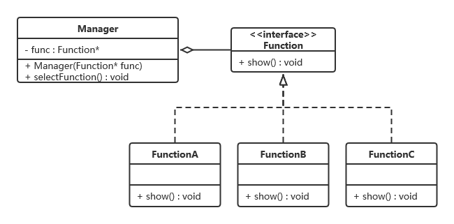

# Effective C++

> 本书每个条款都提供引导，告诉我们如何发展出更好的设计，如何避免常见的问题，或是如何达到更高的效率，但没有任何一个条款放之四海皆准、一体适用。
> 

# 前言

虽然Effective C++这本书已经过于久远，很多内容在现在看来也已不合时宜，但要我来说依然是值得推荐的。说来惭愧，我从未系统地学习过C++，往往只是为了做出一个项目，又恰好碰到了看不懂的，就顺便上网查查，这样东拼西凑起来，也就有了一些基本的了解。而完整读完一本C++书籍，这还是头一次。或许是由于过于无知，阅读之时，我的情绪总是跌宕起伏，震惊、疑惑、感慨、激动，不一而论。因为这本书真可谓管中窥豹，将以往编程时我从未注意过的细节娓娓道来，好叫我一窥C++克苏鲁般的真容，而我的心中也真的有一万头母驴在狂飙。言归正传，之所以推荐，是因为总有些东西是不会过时的，而这些东西，正在这本书中。而且，沿着前人的足迹走过，坑终究是少一些，收获与感悟也总是会更完整一些。

本文大体上是对Effective C++提纲式的提炼与总结，但在一些关键部位，根据我的浅陋理解插入了少量的补充说明。同时，如果条款涉及的内容在C++11中有变动，为了保持书籍内容的完整和对作者的敬意，我仅会在条款的起始位置插入C++11的简单说明。注意本文无法替代原书，仅建议作回忆性提纲使用。鉴于本人才疏学浅，如有错漏还请斧正。

# 这就是C++

## 1. C++是四个次语言的语言联邦

1. C语言
2. 面向对象（C with class）
3. 泛型编程
4. STL

## 2. 以const，enum，inline替换#define

- 原因：宏不会被编译器发现，不会进入符号表，不利于追踪。

- 宏常量→const常量
    
    一种特殊情况是：对于class的专属常量，使用static+const
    
    static成员变量在类内声明，在类外初始化。
    
    <aside>
    🌺 因为static成员不属于对象，属于类，为了保持仅有一份的语义，这块内存应该在类外分配，而内存分配是在定义时完成的，因此类内static成员仅能声明，不能定义，即不能分配内存。
    
    </aside>
    
    **只有static const 整数类型的变量允许【inclass初值设定】。**
    
    ```cpp
    //.h
    private:
    static const int num = 5;
    //这是一个声明式（这是【inclass初值设定】，定义时使用该值初始化，但此时不会分配内存）
    
    //.cpp
    const int ClassName::num;
    //这是定义，因为const int已有初值，所以不可再改。
    ```
    
    这一写法可能会有问题，因为旧编译器会不允许static 成员常量进行【inclass初值设定】，解决方法便是下面的enum hack
    
- static的in-class初值设定→enum hack
    
    由于有时候需要在编译时知道const值，为了避免【in-class初值】问题，借用enum来实现。
    
    例如：编译器在编译时一定要获取数组的大小，则可以enum hack（新cpp中static constexpr强制编译器在编译时解析值）
    
    ```cpp
    private:
    enum {num=5};//这里的num和static const是一样的
    int score[num]
    ```
    
    其理论基础是，enum的数值可以被视为整数类型（**char，short，int，longlong long**），而整数类型允许【in-class初值】
    
- 宏替换→模板+inline
    
    模板为什么加inline详见条款30
    

## 3. const的运用

- const operator*的返回值，禁止a*b=c的情况出现，如if(a*b=c)。
- 对于一个const对象，使用const成员函数进行操作。

```cpp
const char& operator[](std::size_t pos) const{
    return text[pos];
}
char& operator[](std::size_t pos) {
		return text[pos];
}
```

注意non-const operator[]返回的是char&，若是char则只传值导致object[num]=3无法修改text数组

- **const的两种概念**
    
    **bitwise const**：const成员函数不更改对象内存的任何一个bit，即不能改变对象内的任何一个non-static变量。
    
    但这种定义会导致如下问题：
    
    ```cpp
    //返回值char&不加cosnt
    char& operator[](std::size_t pos) const{
    		return text[pos];
    }
    
    char& c=object[0];
    c='j';
    ```
    
    const函数本身确实没有改变对象的变量，但它终究还是导致了改变。
    
    **logical const：**const成员函数可以在调用端察觉不到的情况下修改对象的bits。
    
    以getLength为例：
    
    ```cpp
    class Text {
    	private:
    		bool lengthIsValid;//目前的长度是否有效
    		int textLength;
    		char* pt;
    		int getLength() const {
    			if(!lengthIsValid){
    				textLength = strlen(pt);
    				lengthIsValid = true;
    			}
    			return textLength;
    		}
    }
    
    ```
    
    按logical const的观点，这个函数是可行的。为了让bitwise的编译器同意这一观点，需要使用mutable释放掉 textLength 和 lengthIsValid 的 bitwise constness 约束。
    
- 使用转型来避免重复性代码
    
    可以通过const operator来实现non_const operator：
    
    ```cpp
    const char& operator[](std::size_t pos) const{
        return text[pos];
    }
    //const_cast把char&转成const char&
    //static_cast把ClassName& 转成const ClassName&，
    //是为防止non cast operator又调用non cast operator本身
    char& operator[](std::size_t pos) {
    		return const_cast<char&>(static_cast<const ClassName&>(*this)[pos]);
    }
    ```
    
    反之当然是不行的
    

## 4. 对象的初始化

- 内置对象全部手动初始化

举例：继承自C语言的数组不会自动初始化，而STL的vector就会自动初始化。

不必记忆 何时 何种情境 下 某个 内置类型 会/不会 初始化，这过于繁琐。

在不知道C++会不会帮你初始化的情况下，只需要保证在使用前手动初始化即可。

- **初始化列表**

```cpp
class a {
public:
	a(string aa);
private:
	string a_aa;
};

//Eg1
a::a(string aa){
	a_aa=aa;
}

//Eg2
a::a(string aa):a_aa(aa){}
```

赋值≠初始化

Eg1是赋值操作。在进入构造函数之前，编译器会先调用a_aa的构造函数为a_aa初始化。进入a的构造函数赋值时a_aa已经有了初值。而对于内置类型如int，赋值前不一定有初值，赋值和初始化的成本是一样的。

Eg2是初始化列表。a_aa会以aa为初值，在进入构造函数前进行copy构造。这样明显更高效。

详细可见我的文章：

[zhuanlan.zhihu.com](https://zhuanlan.zhihu.com/p/693771236)

一般做法就是无论是否需要初值，在初始化列表中将所有的成员变量列出。

- 类的**初始化顺序**是固定的
    
    基类先于派生类初始化，成员变量按声明顺序初始化。
    
- **non-local static 对象的初始化**
    
    static的五个作用范围：namespace内，global对象，class内，文件内，函数内
    
    其中函数内的static对象称为local static对象。
    
    其余四种non-local-static对象的作用域是可以跨编译单元（产出单一目标文件的源码，通常是一个.cpp加上包含的.h）的！
    
    <aside>
    🌺 如果一个non-local-static对象1的初始化需要另一个编译单元的non-local-static对象2，对象2可能还没有初始化！C++无法对non-local-static对象的初始化顺序进行定义！
    
    </aside>
    
    解决方法：伟大的单例模式。
    
    将non-local-static对象定义到一个函数里（变成local static对象了），这个函数返回值是该static对象的引用。
    
    ```cpp
    //加上inline降低频繁调用的开销
    inline FileSystem& getFileSystem{
    	static FileSystem fs;
    	return fs;
    }
    ```
    
    能解决的原因是，C++保证local static对象在该函数调用期间，首次遇到该对象的定义式时进行初始化。
    

# 构造/析构/赋值运算

## 5. C++自动生成的函数

> C++11新添加了移动构造函数和移动赋值运算符，所以编译器可以自动为你创建构造函数，copy构造函数，copy赋值操作符，移动构造函数和移动赋值运算符。
> 

对于一个类，编译器可以自动为你创建构造函数，copy构造函数，copy赋值操作符。

<aside>
🌺 这不是一定的，见原文：“惟有当这些函数被需要（被调用），它们才会被编译器创建出来。”

</aside>

下面的文章有详细讨论：

[什么是默认构造函数？_默认构造函数是什么意思-CSDN博客](https://blog.csdn.net/bear_n/article/details/72798301)

只有在类中没有声明构造函数的情况下，编译器才有可能为你自动生成默认构造函数。

也就是说，如果你自行声明了任意一个带参/默认构造函数，那么编译器就不会为你生成默认构造函数。

构造函数，copy构造函数，copy赋值操作符函数这些都是同理。

编译器所做的事情：

- 默认构造函数与析构函数
    
    调用基类的构造/析构函数，调用非static成员的构造/析构函数。
    
    另：除非基类的析构函数是虚函数，否则派生类的析构函数不是虚函数。
    
    反之，基类的析构函数是虚函数，派生类析构函数是虚函数。
    
- copy构造函数与copy赋值操作符
    
    将参数列表中的变量copy到成员变量，比如对于string就会调用string的copy构造函数，内置类型就相当于赋值。
    
    需要注意的是对于copy赋值操作符：
    
    编译器在监测到不合法时会拒绝生成。
    
    比如：
    
    ```cpp
    class A{
    	public:
    		A(string& ss，const int& a);
    		string& s;
    		const int a;
    }
    
    int main(){
    	std::string s1("a1");
    	std::string s2("a2");
    	A a1(s1,1);
    	A a2(s2,2);
    	a1 = a2;
    }
    ```
    
    引用是不可改变指向的，const值是不可改的。因此编译器会拒绝生成。
    
    此外，若基类的copy赋值操作符是private，编译器也会拒绝生成。
    

## 6. 如何拒绝C++自动生成的函数

> 你说得对，但是什么年代了，还在用传统方法？我选择使用=delete。
> 

如果不想让一个类有copy构造和copy赋值操作符的功能，可以创建copy构造函数和copy赋值操作符的声明且不进行实现，并设为private。

但member函数和friend函数还是可以访问到copy构造函数和copy赋值操作符，错误将会在链接期才能被发现(类的定义与使用通常在不同文件中)。

为了将链接期错误提前至编译期,可以设置一个只含有这些函数的声明且设为private的基类,然后用目标类来继承它.随之而来的缺点就是继承所带来的效率降低以及可能导致的多重继承的出现进而阻止"empty base class optimization"。

## 7. 多态基类应当声明virtual析构函数

先举一个多态的例子：

```cpp
//简单工厂模式
class Factory{
	public:
		Produce* createProduce(int);
		Factory();
		~Factory();
}
class Produce{
	public:
		string name;
		virtual void printName();
		Produce();
		virtual ~Produce() = 0;
}
class Produce1: public Produce{...}
class Produce2: public Produce{...}
```

假设现在Produce* pPd = factory.createProduce(1);

当通过pPd开始销毁Produce1时，

- 若~Produce()不是虚函数，则导致未定义行为，通常是只有基类的析构被调用。因为编译器得知此函数是非虚函数，通过指针类型Produce跳转到Produce的函数表，找到基类的析构并执行。
- 若Produce()是虚函数，则派生类的析构自动被编译器识别为虚函数，且构成重写（这是虚函数的两个特例之一：协变和析构。析构即使不同名，经编译器处理后都是Deconstractor），则会通过该对象（是派生类）的虚函数表先查询到派生类的析构函数并执行，派生类的析构中应当调用基类的析构，于是所有类都会被析构了。
- 注意virtual ~Produce() = 0;需要提供一份实现，因为派生类析构会调用基类析构，有调用就必须有实现。（我的认知被gpt误导了：注意**纯虚函数也可以在基类实现**）
- 不要轻易继承不带virtual析构的类！！！很容易通过指向派生类的基类指针陷入未定义行为（如std::string，STL的容器等）

## 8. 异常留在析构函数内

- 不要轻易地让析构函数吐出异常。因为C++在面对两个或更多异常的时候，会结束程序或导致不明确行为，析构一个数组的对象可能就会崩。如果一个被析构函数调用的函数可能抛出异常，析构函数应该捕捉任何异常，然后吞下他们或结束程序。
- 如果要对异常进行操作，应当安排在普通函数而非析构中进行。

## 9. 不要在构造和析构中调用virtual函数

```cpp
class A{
	public:
		A();
		virtual void log() const = 0;
}
A::A(){
	...
	log();
}
//错误的期望：A1()->A()->A1::log()
class A1: public A{
	public:
		A1();
		virtual void log() const;
}
```

- 原因是在调用基类的构造函数时，基类的构造函数中对virtual函数的调用永远不会沿类继承树往下传递到派生类中去。也就是说，基类的构造和析构函数中的virtual函数其实不是virtual函数。
- 进一步地，virtual函数不生效的原因（以构造函数为例）：
    - 表层原因：当派生类调用构造函数后，先执行基类的构造函数，此时派生类的成员变量尚未初始化，也不会有虚函数表。既然没有虚表，这个virtual函数又该如何找到派生类的重写函数呢？当然是不可能的。
    - 更根本的原因：【**运行时类型识别（RTTI）】**：在基类构造函数期间，如果使用运行时类型识别机制（例如`dynamic_cast`或`typeid`），对象会被识别为基类类型，而不是派生类类型。
        
        也就是说：在基类构造函数执行期间，对象还没有完全初始化为派生类对象，**它仍然是一个基类对象**。
        
        举例：
        
        ```cpp
        class Base {
        public:
            Base() {
                std::cout << "Base constructor" << std::endl;
                print();
                std::cout << "Type in Base constructor: " << typeid(*this).name() << std::endl;
            }
        
            virtual void print() {
                std::cout << "Base print" << std::endl;
            }
        };
        
        class Derived : public Base {
        public:
            Derived() {
                std::cout << "Derived constructor" << std::endl;
                print();
                std::cout << "Type in Derived constructor: " << typeid(*this).name() << std::endl;
            }
        
            void print() override {
                std::cout << "Derived print" << std::endl;
            }
        };
        
        int main() {
            Derived d;
            return 0;
        }
        /*
        输出结果：
        
        Base constructor
        Base print
        Type in Base constructor: Base
        
        Derived constructor
        Derived print
        Type in Derived constructor: Derived
        ```
        

## 10. 令operator=返回对this指针的引用

```cpp
class Widget {

	public:

		Widget& operator=(const Widget& w){
			...
			return *this

		}

}
```

其他operator也是一样的。

这一协议由string，vector等内置，标准库类型共同遵守。

好处是可以连锁赋值：

```cpp
Widget w1,w2,w3;
w1=w2=w3=new Widget();
```

## 11. operator=的自我赋值与异常安全性

由于别名的存在，如`*px=*py //(二者指向同一内存)`，自我赋值是有可能发生的。

- 考虑如下代码，它不能实现自我赋值：
    
    若rb.pa和this.pa指向同一个对象，delete pa会导致rb.pa和this.pa共同指向的对象被释放，返回时pa指向了被释放的内存。
    
    ```cpp
    class A{}
    class B{
    	public:
    		B& operator=(const B& rb);
    	private:
    		A* pa;
    }
    
    B& B::operator=(const B& rb){
    	delete pa;
    	pa = new A(*rb.pa);
    	return *this;
    }
    ```
    
- 传统做法：进行证同测试。
    
    ```cpp
    B& B::operator=(const B& rb){
    	if(this == &rb) return *this;
    	delete pa;
    	pa = new A(*rb.pa);
    	return *this;
    }
    ```
    
    但这样不具备异常安全性：
    
    new A(*rb.pa) 内存不够分配会导致异常，执行A的拷贝构造函数时也可能抛出异常。
    
    抛出异常后程序会跳转到异常处理机制中，并跳过剩余的代码行。
    
    由于此时已经delete pa; 而pa又没有置nullptr，导致其成为了悬空指针。
    
- 确保异常安全
    
    ```cpp
    B& B::operator=(const B& rb){
    	A* temp_pa = pa;
    	pa = new A(*rb.pa);
    	delete temp_pa;
    	return *this;
    }
    ```
    
    若pa = new A(*rb.pa);异常，由于尚未进行delete操作，此时内存是安全的。
    
    同时，这段代码也确保了自我赋值的安全。
    
    **确保operator=的异常安全性，往往也会自动获得自我赋值安全。**
    
- copy and swap（详见条款29）
    
    ```cpp
    B& B::operator=(const B& rb){
    	B temp(rb);
    	swap(temp);//交换this和rb
    	return *this;
    }
    
    //注意是传值而非传引用
    B& B::operator=(const B rb){
    	swap(rb);//交换this和rb
    	return *this;
    }
    ```
    

## 12. 复制对象的每一个成员

如果程序员选择不使用编译器生成的copy构造函数和copy赋值操作符，那么当copy不完全时，编译器大概率不会有任何报错。可以理解为一种复仇行为（乐）。

- 对象内的local变量
    
    每在类内新填一个变量，就要修改一次copy构造函数和copy赋值操作符。
    
- 有继承的情况下的基类的变量
    - 如下代码会有问题：B继承自A的a和b没有在初始化列表中出现。
        
        **如果一个派生类的构造函数(任意一个构造函数)没有显式调用基类的构造函数，那么编译器会自动调用基类的默认构造函数（编译器强制要求有一个默认构造函数，若其不自动生成就会报错要求程序员生成）。**
        
        所以a和b会被默认初始化而非拷贝。
        
        ```cpp
        class A{int a;int b;}
        class B:public A{
        	public:
        		B(B& b);
        		B& operator=(B& b);
        	private:
        		int c;
        }
        
        B::B(B& b)
        :c(b.c)
        {
        	log("1");
        }
        B& B::operator=(B& b)
        {
        	log("2");
        	c=b.c;
        	return *this;
        }
        ```
        
    - 解决方法：派生类的copy构造函数在初始化列表中调用基类的copy构造函数，派生类的copy赋值操作符在函数体中调用基类的copy赋值操作符。
        
        ```cpp
        B::B(B& b)
        :**A(b),**
         c(b.c)
        {
        	log("1");
        }
        B& B::operator=(B& b)
        {
        	log("2");
        	**A::operator=(b);**
        	c=b.c;
        	return *this;
        }
        ```
        
- copy构造函数作用是构造一个对象，copy赋值操作符作用是为已有的对象赋值。
    
    二者泾渭分明，不可互相调用。
    
    若二者有重复性代码，应该放进一个private函数并通常命名为init。
    

# 资源管理

## 13. 以对象管理资源

> auto_ptr被弃用，C++11引入了unique_ptr和shared_ptr。
> 
- 以对象管理资源的思想
    
    考虑到函数体内发生**异常**，**多重回传路径**(return,goto……)等许多复杂的内存管理情况，有必要介绍一套基于对象及构造析构copy函数的资源管理办法，它可以近乎消除内存管理问题：
    
    <aside>
    🌺 把资源放进**对象**内，当控制流离开函数体时，对象的**析构函数**便会自动调用。
    
    </aside>
    
    基于这一思想，C++98加入了auto_ptr，这是一个类似指针的类，其作用便是在离开指针作用域时自动释放指针所指的对象。
    
    ```cpp
    void func(){
    
    	std::auto_ptr<ClassName> ptr(createObject());
    	
    	.......//正常使用指针
    	
    }//离开作用域自动释放
    ```
    
    两个重要思维：
    
    - 及时把资源放进管理对象
        
        **RAII**(Resource Acquisition Is Initialization) :取得资源之时便是初始化之时。要义便是一取得对象就把它放进管理对象（通过初始化亦或赋值等其他操作）。
        
    - 管理对象运用析构函数释放资源
        
        在管理对象的析构函数中释放资源，如果释放资源导致抛出异常，运用条款8的思想解决。
        
- auto_ptr的问题
    
    由于auto_ptr析构时会销毁它指向的对象，所以不可让多个auto_ptr指向一个对象，不然一个对象删除不止一次，陷入未定义行为的泥潭。
    
    为了解决这个问题，auto_ptr有了一个逆天性质：通过copy构造函数或copy赋值运算符赋值时，新auto_ptr获得对象的控制权，而旧auto_ptr会变成null。
    
    也因为这个性质，auto_ptr不能塞进STL容器。因为STL容器要求赋值后两个容器都是正常的，而auto_ptr赋值后一个就失效了！
    
- 对智能指针的改进
    
    在C++11中，C++放弃了auto_ptr，主要原因就是逆天的赋值性质颠覆了传统定义。
    
    而在auto_ptr的尸体上长出了unique_ptr和shared_ptr两朵花。
    
    unique_ptr彻底放弃了copy构造和copy赋值，保留了原auto_ptr的独占性，控制权的转移通过std::move完成，这样更加清晰明了。
    
    shared_ptr保留了copy构造和copy赋值，但copy行为是正常的，不会导致指针置空。
    
    智能指针可以塞进STL容器了！
    
    而在资源管理上：
    
    **shared_ptr ：** 如果有多个函数可能在不同时间使用该对象，使用 shared_ptr。
    
    **unique_ptr：**如果对对象的访问是连续的，那么就选择unique_ptr。所谓连续，是指对象都将从一个上下文中访问。例如，创建者创建并立即使用的对象。创建后，对象存储在*第一个*数据结构中。然后，对象要么在第一个数据结构之后被销毁，要么被移动到*第二个*数据结构。
    
    这里只做引申，两种智能指针的具体情况不再赘述。
    

## 14. 在资源管理类中小心copy行为

 当你自己设计一个资源管理类时，如果两个RAII对象（在RAII思想中用于管理的对象）间发生了copy行为，该怎么处理呢？

- 解决提出问题的行为，直接禁止copy。（正如unique_ptr所做的）
- 引用计数。（正如shared_ptr所做的）
- 深拷贝。不仅RAII对象要拷贝，RAII对象所管理的资源对象也要拷贝一份出来。这样就是两个RAII对象管理两个相互独立的资源对象。
- 转移控制权。（auto_ptr的做法，当然不推荐这样做）

## 15.在资源管理类中提供对原始资源的访问

- 提供对资源取值的访问
    
    正如智能指针所做的，重载→和*
    
- 提供裸指针
    
    有时，面对C风格的API，必须提供裸指针。因此需要考虑在资源管理类中提供对裸指针的访问。
    
    - 显式转换
        
        提供一个get函数，返回裸指针
        
    - 隐式转换
        
        ```cpp
        class B{
        public:
        	operator A () const{return a;}
        private:
        	A a;
        }
        
        B b;
        //有了转换函数，b可以转换成a
        A a=b;
        ```
        
        显式转换缺点是麻烦，隐式转换缺点是不安全。如上所示，a拷贝构造后可能没有手动释放。
        
    
    ## 16. new和delete需要相同的形式
    
    <aside>
    🌺 使用new→delete & new[ ]→delete[ ]     new→delete[ ]和new[ ]→delete是未定义行为！
    
    </aside>
    
    原因：
    
    当使用new时：
    
    - 通过operator new分配内存。
    - 调用对象的构造函数。（可能是一个或多个）
    
    同理，调用delete时：
    
    - 调用对象的析构函数。（delete在对象中动态分配的内存，这块内存不在delete的范围内）
    - 通过operator delete释放内存。
    
    如果想要释放一个数组的内存：
    
    - 数组所处的内存会记录一份数组大小，方便delete指向对象数组的指针知晓调用多少次析构。
    - 如果是delete[ ]就会考虑这份对数组大小的记录，而delete不会考虑。
    - 由于new→delete[ ]和new[ ]→delete是未定义行为，所以即使是内置类型的数组也要遵循这一条款。
    
    <aside>
    🌺 如果一个带有指向动态内存的指针的class提供了多个构造函数，必须使用相同的new，否则就无法确定使用哪个delete
    
    </aside>
    

## 17. 用独立语句将newed对象置入智能指针

- 问题的关键在于：
    
    <aside>
    🌺 C++不同于Java和C#，编译器以何种次序完成参数的核算是不定的，因为这样可以带来更高的效率。
    
    </aside>
    
- 考虑以下代码
    
    ```cpp
    void func(std::shared_ptr<A> p,int a);
    int getInt();
    
    func(std::shared_ptr<A>(new A),getInt());
    ```
    
    调用func前要执行三件事：
    
    - new A
    - 构造shared_ptr
    - 调用getInt（）
    
    如果编译器认为把调用getInt（）放在第二位执行，就可能出现问题：
    
    - new A
    - 调用getInt（）
    - 构造shared_ptr
    
    如果调用getInt导致异常，new A返回的指针就会遗失，造成内存泄露。
    
    因为指针此时尚未置入智能指针！
    
- 解决办法就是：用独立语句将newed对象置入智能指针
    
    因为**编译器对“跨越语句的操作”没有重新排列的自由**
    

# 设计与声明

## 18.设计不易被误用的接口

- **促进正确使用**
    - **接口的一致性**
        
        比如STL容器获取大小的接口统一为size函数。
        
    - **与内置类型的行为兼容**
        
        比如在内置类型中，对a*b赋值并不合法，所以除非有特殊目的，自己设计的类也应延续这一规则。
        
- **不易被误用**
    - **建立新类型并限制可能的值**
        
        比如：
        
        ```cpp
        //有一个Date类，构造时接收int Year,int Month,int Day三个参数:
        Date(int year,int Month,int Day);
        //更好的做法是引入Year Month Day三个类，并禁止用户自行创建类的对象
        class Month {
        public:
        	static Month Jan() {return Month(1);}
        	static Month Feb() {return Month(2);}
        	.........
        private:
        	Month(int m);//private禁止用户使用
        }
        ```
        
        <aside>
        🌺 不直接创建static对象交给用户使用，而是使用static函数创建对象。这样做的原因在条款4（及时回忆！），编程时尽量避免non-static object。
        
        </aside>
        
    - **限制类型上的操作**
        
        比如对a*b返回const防止赋值。
        
    - **消除用户的资源管理责任**
        
        ```cpp
        //原始的做法，调用后用户理应把A*放进智能指针，但用户不一定会这么做
        A* createAFamily();
        
        //我们可以要求用户必须使用智能指针来接受返回值。
        std::shared_ptr<A*> createAFamily();
        
        //如果设计者希望析构时采取特殊的操作如：getRidOfA而不是直接delete
        //在createAFamily()内创建智能指针时可以绑定智能指针的删除器
        std:shared_ptr(pA,getRidOfA);
        ```
        
        定制删除器还可以解决DLL问题和解除互斥锁等。
        

## 19. 像设计type一样设计你的class

程序员应当像设计内置类型一样设计你的类，思考以下问题：

- 这个类真的是必要的吗？
    
    如果只是新建一个派生类来为已有的class添加额外功能，那么单纯添加几个函数或模板更好。
    
- 这个类足够一般化吗？
    
    如果需要一系列相似的类的话，应该定义一个class template
    
- 如何创建和销毁？
    
    operator new，operator new[ ]，operator delete，operator delete[ ]
    
- 对象的初始化和赋值应该有什么差别？
    
    构造函数和重载赋值运算符
    
- 对象以值传递时应该发生什么？
    
    拷贝构造函数
    
- 对象的合法值有哪些？
    
    对于类的成员变量来说，可能只有一些值是合法的，需要进行约束
    
- 这个类需要加入某个继承网络吗？
    
    受到多态的影响(virtual与non-virtual)
    
- 这个类需要怎样的转换行为？
    
    如果希望允许T1对象转换为T2对象，
    
    就需要 在T1内写operator T2 或 在T2内写非explicit的单参构造函数。
    
    如果T1和T2只允许explicit构造函数存在，
    
    那么就无法使用类型转换操作符和非explicit的单参构造函数，
    
    那就只能自己写一个转换函数。
    
- 什么样的操作符和函数是这个类需要的？
    
    见条款23，24，46。
    
- 什么样的标准函数应该被驳回？
    
    如条款6，不需要copy操作就放进private
    
- 谁能取用本类的成员？
    
    public，protected，private，友元函数
    
- 有哪些接口不需要声明？
    
    先看看条款29再说
    

## 20. 用pass-by-reference-to-const替换pass-by-value

- 直接原因
    
    值传递会调用若干个构造和析构，以及拷贝资源。
    
    引用传递什么都不需要，效率明显更高！
    
    而返回值加const是为了向值传递看齐，毕竟值传递也不会对对象做任何修改。
    
- 避免对象切割
    
    如果函数形参是基类，而实参是派生类的对象。
    
    那么在**值传递**时，属于派生类的特性会全部消失（被切割）。这很合理，因为调用的是基类的copy构造函数嘛，生成的就是基类。
    
    而在**引用传递**时，虽然引用和指针在C++标准中是两个不同的概念，但在编译器的实现层面，左值引用往往会按指针实现（至少在这本书问世时是这样，现代C++只能说我不确定）。在这种情况下，可以把传引用理解为传指针。因此，基类指针指向派生类对象不会有问题。
    
- 对于内置类型，值传递比引用传递更高效些。
    
    对于STL的迭代器和函数对象，因为习惯上它们都被设计成值传递，所以如果没有对象切割问题的话，也使用值传递。
    
    但对于内存很小的自定义类型，使用值传递不一定更高效，一般使用引用传递。
    
    原因：
    
    - 需要考虑构造函数和析构函数的影响。
    - 编译器不一定会把这个类型放进缓存器，但一定会把指针放进缓存器。
    - 这个类以后可能会消耗更多的内存。

总结：除了内置类型和STL的迭代器和数组对象，尽量不使用值传递。

## 21. 必须返回对象时，不要返回引用

- 以下都是战犯行径：
    - 若对象的内存分配在栈上：函数结束就会销毁，陷入未定义行为的泥潭。
    - 若对象的内存分配在栈上，且为了返回而声明为static：
        - 多线程不安全
        - 如果static对象与运算相关
            
            ```cpp
            if( (a*b) == (c*d) )
            
            实际上：
            if(operator==( operator*(a,b) , operator*(c,d) )
            调用时先调用两次operator*再调用operator==，
            operator== 通过返回的地址取到static对象的值，
            其值都是第二次调用operator*之后的结果，我比我自己。
            ```
            
        - 若对象的内存分配在堆上
            
            对于返回引用来说，返回之后赋值给另一个对象，这块内存就没有办法释放了！
            
            如果是返回裸指针，我猜倒还好？只是要记得释放。
            
- 如果必须要返回对象，在返回值和返回引用之间抉择的话，那还是直接返回值吧，相信编译器的智慧。

## 22. 将成员变量声明为private

- 不将成员变量设为public的理由：
    - 参考条款18，把接口统一为public函数更方便客户记忆，保持了语法上的一致性。
    - 可以精细地控制对各个成员变量的权限：只允许读，只允许写，读写，拒绝访问。
    - 封装。当你更改了某个功能函数的实现方式时，用户最多只需要重新编译。（利用条款31甚至不需要重新编译）
    - 可以实现额外的功能，提供更大弹性。(C# properties)
        
        在触发封装函数时可以进行很多额外的操作，比如：
        
        - 通知其他对象；
        - 验证约束状态；
        - 更新对象的状态；
        - 多线程环境下的同步控制
        - ………….
- 不将成员变量设为protected的理由：
    
    封装比想象的更重要，**代码的封装程度与改变带来的客户代码的破坏程度成反比，**封装程度越高，破坏越小。
    
    而protected并不比public更具封装性，只是破坏范围从全部缩小到派生类，破坏性还是很高。
    
    从封装的角度看，只有两种访问权限：提供封装的(private)和不提供封装的。
    

## 23. 尽可能用non-member&non-friend函数 替换 member函数

- 假如一个class内有三个相关的public功能函数，为了方便用户，把这三个函数装进一个新函数，使用 non-member&non-friend函数 会比 member函数 或 friend函数 更好。

原因：

对于private数据而言，越多函数可以访问到它，它的封装性也就越低。

一个non-member&non-friend函数访问不到private变量，带来的封装性当然更好。

- 对于non-member&non-friend函数，C++的自然做法：
    
    把这个函数和对应的class置于相同的**命名空间**。
    
    注意命名空间是可以跨文件编译的，把不同的功能放进不同的文件，然后用命名空间联系起来是一种降低耦合的同时可拓展性很高的方法。
    

- 插一嘴友元：友元在实现内部类的时候是有使用的空间的。
    
    比如UE的一些类虽然是封装的，但是还存在一些上层的管理类。为了让管理类能操作到封装类的私有内容，就通过设置友元类的方式，让封装类对管理类来说是public的。
    
    从模块的角度来看，对外的接口往往由管理层提供，内部的封装类往往是黑盒的，这其实也是封装了。
    

## 24. 若所有参数皆需类型转换，使用non-member函数

```cpp
class Num {
public:
	//构造函数刻意不声明explicit，允许隐式转换
	Num(int num);
	const Num operator* (const Num& rhs) const;
	int getNum();
private:
	......
}

//若要实现和内置类型的算术运算
Num n(1);
Num res;
res = n * 2; //正常
res = 2 * n; //报错
```

- 报错的原因：
    - 对于 const Num operator* (const Num& rhs) const;
        
        它的第一个参数是隐含的this指针，第二个参数是参数列表中的const Num& rhs。
        
        调用时，**左操作符充当第一个隐含参数（谁调用谁充当）**。
        
    - 第一次调用时，Num类型的n调用operator*，n的地址传给this指针，而2可以进行隐式类型转换转为Num类型。
    - 第二次调用时，由于**只有参数列表中的参数才允许进行隐式类型转换**，所以2无法隐式转为Num类型，也就无法调用operator*成员函数。
- 解决方法：
    
    使用non-member函数：
    
    **只有参数列表中的参数才允许进行隐式类型转换，所以2无论是左操作符还是右操作符皆可。**
    
    ```cpp
    const Num operator* (const Num& lhs,const Num& rhs) const{
    	return Num(lhs.getNum()*rhs.getNum());
    }
    ```
    
    出于封装考虑，非必要情况下不将其设为friend函数。
    

## 25.不抛出异常的swap函数

- 提一嘴：
    
    sawp函数对自我复制检查和异常安全性有很重要的作用（条款29）。
    
    因此，swap函数必须保证不会出现任何异常。
    
    通常异常来自于对自定义类型的操作，比如各个构造函数都允许抛出异常，而对内置类型进行操作被视为是安全的。
    
    所以一个高效的swap都只对内置类型进行操作，比如指针。
    
- 需要对swap函数进行特化：
    
    std::swap的缺省实现就是简单地通过temp,a,b之间拷贝三次。
    
    现考虑两个包含了指向动态内存的指针且拷贝操作都设为深拷贝的对象，如果想让他们之间的swap只交换指针的值以提高效率，就需要进行**特化**操作。
    
- 前置知识：
    - 特化分为**全特化**和**部分特化（偏特化）。**
        
        **全特化：**将所有模板参数固定成指定类型。
        
        **部分特化：**把模板参数的一部分固定成指定类型（一部分既可以指特化参数列表里的一部分，也可以指把一个参数特化了一部分，如把T特化Widget<T>）。
        
        **只有类模板允许部分特化**。函数模板不允许**部分特化**，但允许**重载**。
        
    - 在C++的std命名空间内，不允许创建新的模板（重载属于创建新的），只允许对模板进行特化。
    - ADL（Argument-Dependent Lookup）规则，也称为Koenig查找，是C++语言中的一种名称查找规则。ADL规则在查找函数名称时，除了在当前作用域中查找，还会根据函数参数的类型在与这些类型相关的命名空间中查找。
- 非模板类的特化：
    
    如果需要swap的类不是模板类，则参考以下代码即可：
    
    对std:swap函数模板进行全特化，调用类内的swap函数。
    
    ```cpp
    class Widget {
        public: void swap(Widget& other) {
            using std: :swap;
            swap(pImpl, other.pImpl);
        }
        ...
    };
    
    namespace std {
        template<>
        void swap<widget>(Widget& a, Widget& b) {
            a.swap(b);
        }
    }
    ```
    
- 类模板的特化
    
    如果widget类是模板类，则不允许部分特化：
    
    ```cpp
    //这是不合法的行为！
    namespace std {
    	template<typename T>
    	void swap<widget<T>>(Widget<T>& a, Widget<T>& b)
    }
    ```
    
    一般这种情况下可以重载swap，但是由于swap在std命名空间内，std命名空间内不允许重载：
    
    ```cpp
    //std命名空间内不允许重载
    namespace std{
    	template<typename T>
    	void swap(Widget<T>& a, Widget<T>& b)
    }
    ```
    
    **正确做法：**
    
    声明一个non-member swap函数，令其调用member swap，但是non-member sawp不再是std空间内的函数模板，而是放在类所在的命名空间。
    
    ```cpp
    namespace W{
    	template<typename T>
    	    class Widget {...};//内含member swap 
    	    template<typename T>
    	    void swap(Wiget<T>&a, Widget<T>&b) 
    	    {
    			    a.swap(b);
    	    }
    }
    ```
    
- 类模板特化的做法也适用于非模板类，对于非模板类，还有必要在std里特化吗？
    
    答案是有的，因为客户有可能直接调用std::swap。
    
- 调用swap应该使用using std::swap;
    
    根据ADL规则，会先在T的类型所在的命名空间中查找函数名，如果找不到实现，又因为using std::swap;所以可以调用std::swap。
    
    ```cpp
    template<typename T>
    void dosomething(T& a;T& b){
    	using std::swap;
    	swap(a,b);
    }
    ```
    

# 实现

## 26. 尽可能延后变量定义式出现的时间

- 把变量拖到使用前的最后一刻再定义
- 最好能拖到可以获取到初值之后再定义
    
    因为构造时初始化比先默认构造再赋值更高效
    
- 考虑循环，变量应该定义在循环外还是循环内？
    - 定义在循环外：一次构造+析构，n次赋值，且变量作用域被扩大了。
    - 定义在循环内：n次构造+析构。
    - 如果这段代码对效率十分敏感 且 程序员能判断出对象的赋值比构造更高效，则定义在循环外，否则定义在循环内。

## 27.尽量少转型

- 四大cast：
    - const_cast：
        
        唯一能擦除去掉对象的const属性的cast。
        
    - dynamic_cast：
    它通常用于多态类型之间的转换，特别是从基类指针或引用转换为派生类指针或引用。转换失败时，它会返回`nullptr`（对于指针）或抛出`std::bad_cast`异常（对于引用）。
        
        **可能耗费重大运行成本！**
        
    - static_cast:
        
        进行显式转换
        
        - 基本数据类型之间的转换，例如`int`到`float`。
        - 基类和派生类之间的指针或引用转换，但不保证安全性。
        - 将`void*`指针转换为其他类型的指针。
    - reinterpret_cast：
        
        不常用，用于重新解释数据的位模式而不做任何实际的转换。
        
        具体动作取决于编译器，也就意味着它不可移植。
        
        比如将指向int的指针转化为int，当把指针转换为整数时，实际上是在直接读取指针的位模式并将其解释为一个整数。反之亦然。因此，从技术上讲，这不是在改变数据本身，而是改变我们如何看待这些数据。
        
- 一个错误观念：转型什么也没做，只是让编译器把一种类型视为另一种类型。
    
    实际上转型动作几乎都会让编译器生成新的机器码：
    
    - 比如int转float，二者的底层描述就不相同，当然会有变化；
    - 再比如多继承情况下的派生类指针转基类：
        
        现有C继承A和B
        
        ```cpp
        +----------------+
        |      A         | <- A 派生对象
        +----------------+
        |      B         | <- B 派生对象
        +----------------+
        |      C         | <- C 的数据
        +----------------+
        ```
        
        假设 A 子对象位于 C 对象的起始地址，B 派生对象紧随其后，C 的其他成员数据在最后。
        
        1. A* ptrA = &objC;
            
            由于 A 派生对象位于 C 对象的起始地址，因此 ptrA 指向 objC 的起始地址，不需要进行调整。
            
        2. B* ptrB = &objC;
            
            由于 B 派生对象位于 A 派生对象之后，编译器需要调整指针，使其指向 C 对象中的 B 子对象的起始地址。假设 A 派生对象的大小是 sizeof(A)，那么 ptrB 实际上应该指向 objC + sizeof(A) 的地址。
            
        
        <aside>
        🌺 注意对象的内存布局是由编译器决定的，这就意味着如果依靠内存布局进行编码（比如用char*指针修改对象）是未定义行为，在一个平台能跑通，在其他平台很有可能失败！
        
        </aside>
        
- 通过转型调用成员函数导致错误
    
    ```cpp
    class A{
    	virtual void change();//进行了实现
    	......
    };
    class B:public A{
    	virtual void change()
    };
    B::show(){
    	static_cast<A>(*this).change();
    	......
    }
    ```
    
    程序员可以希望通过static_cast<A>(*this)调用基类的虚函数，但这样的做法是错误的。
    
    原因：
    
    static_cast<A>(*this)返回的是一个 this指向的对象中 与A有关的成分 的副本。
    
    这就是说，这个副本与this对象中的基类成分没有关系，如果这个change有修改数据的操作，这个副本对象充当change函数的this指针，修改的是副本的数据，this对象的数据没有变化。
    
    正确的写法：
    
    ```cpp
    B::show(){
    	A::change();
    	......
    }
    ```
    
- 尽量不使用dynamic_cast
    - dynamic_cast的执行速度相当**慢**。
        
        一个比较普遍的实现版本是基于比较class名字的字符串。继承体系有几层，最多就会调用几次strcmp，如果多重继承则开销更大。
        
    - 避免dynamic_cast的方法
        - 通常使用dynamic_cast是由于程序员想让一个指向基类的指针或引用执行派生类的操作函数。
        - 改进做法一：使用STL容器并直接在里面存储指向派生类的智能指针。在需要使用时，通过容器的迭代器进行调用操作。
        - 改进做法二：使用多态。

## 28. 避免返回handles指向对象内部成分

- 尽量不要把public成员函数（尤其是const成员函数）的返回值设为private变量的handles（指针，引用，迭代器等），因为这会导致用户可以修改private变量。不是说不能返回handles，但至少加上const以限制潜在的不合理的修改行为。
- 即使加上const，也是有悬空指针的风险的。因为要考虑返回的对象的生命周期。

## 29. 确保异常安全

- 异常安全的两个条件：
    - 不泄露任何资源
    - 不允许数据出错
    
    考虑以下代码：
    
    ```cpp
    void PrettyMenu::changeBackground(std::istream& imgSrc){
    	lock(&mutex);
    	delete bgImage;
    	++imageChanges;
    	bgImage =new Image(imgSrc);
    	unlock(&mutex);
    }
    ```
    
    new Image(imgSrc)抛出异常时，mutex就不会被unlock了，资源泄露。
    
    此时bgImage指向了损坏的对象，且imageChanges计数错误，数据出错。
    
- 解决资源泄露：
    
    引入资源管理类（如智能指针），离开作用域后自动析构。
    
    ```cpp
    void PrettyMenu::changeBackground(std::istream& imgSrc){
    	Lock ml(&mutex);
    	delete bgImage;
    	++imageChanges;
    	bgImage =new Image(imgSrc);
    }
    ```
    
- 解决数据出错：
    - 一个异常安全函数在抛出异常后会提供以下三个保证之一：
        - 基本保证：程序的所有数据都正常，但具体状态不可预料。
            
            比如构造一个对象抛出异常时，这个对象可能继续拥有原来的值，也可能拥有一个缺省值，但具体是哪个值不可预测。
            
        - 强烈保证：程序的具体状态不改变。
            
            如果函数成功，就是完全成功；
            
            如果函数失败，程序恢复到调用函数之前的状态。
            
        - 不抛出保证：承诺绝不抛出异常。
            
            作用于内置类型上的操作都具有non-throw保证。
            
            ```cpp
            void doSomething() throw();//声明不会抛出异常
            void doSomething() noexcept;//C++11以后改用这一声明方式
            ```
            
            注意这只是声明不会抛出异常，不代表一定不会抛出异常。
            
            是否抛出异常是由函数的实现决定的，与这个声明无关。
            
            如果实现中抛出了异常，这会导致`std::unexpected`被调用，通常会终止程序。
            
    - **copy and swap**
        
        用于提供强烈保证。
        
        首先创建副本，在函数执行过程中操作副本；
        
        如果操作成功，对副本和原始资源进行swap；
        
        如果操作失败，可以恢复到原始状态。
        
        ```cpp
        void PrettyMenu::changeBackground(std::istream& imgSrc){
        	using std::swap;
        	Lock ml(&mutex);
        	std::trl::shared ptr<PMImp1>
        	pNew(new PMImpl(*pImpl));
        	pNew->bgImage.reset(new Image(imgSrc)); //修改副本
        	++pNew->imageChanges;
        	swap(pImpl，pNew);
        }
        
        ```
        
- 一个函数如果调用了其他函数，那它的异常安全保证就不仅仅取决于它自己，还取决于调用的其他函数，它的保证等级等于所有函数中最低的保证等级。

## 30. 透彻了解inline函数

> “inline原本的建议内联的作用已经失效了，因为现代编译器已经足够智能，能够自己决定是否内联。**C++17**后对inline的解释是“**允许重复定义**”，也就是说，在头文件写函数实现应该加上inline（比如用于header-only库）。这其实是旧inline的副作用，因为如果需要内联，那么需要把函数定义到头文件，而是否内联由编译器决定：如果成功内联，那自然不需要函数定义了；如果有多个编译单元拒绝了内联，就会生成多份函数定义，为了在链接时不报错，由inline修饰的函数会生成弱符号。“
> 

由于时代变迁之下inline作用的变化，这一条款我主要记录书中关于 编译器考虑是否inline 的 内在逻辑 的内容，当然书中的内容也肯定是不全面的，现代编译器在背后做的太多了。

- outline：即外联。正常情况下，编译器在C++内存模型的代码区为一个函数分配一块内存，当读到调用这个函数的指令时，就跳转到这块儿内存。
    
    inline（特指旧inline）：即内联。编译器在本该调用函数的地方直接插入函数代码本体，省去了指针跳转到指定代码区域（即调用函数）的开销，但代价是.o文件的体积增大。
    
    因此，对本体小而调用频繁的函数inline的效果更佳。
    
- 隐式inline：在类内声明函数时直接实现；
    
    显式inline：直接声明inline，但这个声明只是建议，编译器自行决定是否inline。
    
- 为什么inline函数和模板通常都放在头文件里？
    - 编译全过程：预处理→编译→汇编→链接
        - 预处理阶段：
            
            主要处理一些预处理指令，比如#include、宏定义、条件编译。
            
        - 编译阶段：
            
            进行语法分析、词法分析和语义分析，并且将代码优化后产生相应的汇编代码文件（ASCII文件），即.s 文件。这个过程是整个程序构建的核心部分，也是最复杂的部分之一。
            
        - 汇编阶段：
            
            根据不同平台（Windows、Linux）的汇编器将汇编代码翻译成机器码，即生成二进制可重定向文件（.o）。
            
            任何一个源文件在进行编译阶段的时候会去产生**符号表**，符号表中存放的就是程序所产生的符号（例如：函数名，变量名等），我们的编译阶段是不会去给符号分配正确的地址。**这些符号都没有被分配地址，因此.o文件没有经过链接是无法执行的。**
            
        - 链接阶段：
            - 步骤：
                - 第一步：由于每个.o文件都有都有自己的代码段、bss段，堆，栈等，所以链接器首先将多个.o 文件相应的段进行合并，建立映射关系并且去合并符号表。进行符号解析，符号解析完成后就是给符号分配虚拟地址。
                - 第二步：将分配好的虚拟地址与符号表中的定义的符号一一对应起来，使其成为正确的地址，使代码段的指令可以根据符号的地址执行相应的操作，最后由链接器生成可执行文件。
            - 链接的两种方式
                - 静态链接：
                    
                    链接器在将所有目标文件集链接到一起的过程中，会为所有当前未解决的符号构建一张【未解决符号表】。
                    
                    当所有显示指定的目标文件都处理完毕时，链接器将到【静态库】（.lib）中去寻找“未解决符号表”中剩余的符号。
                    
                    如果未解决的符号在库里其中一个目标文件中定义，那么这个文件将加入链接过程，然后链接器继续工作直至处理完【未解决符号表】。
                    
                    总的来说，静态链接就是在链接阶段把.o文件中所依赖的【静态库】链接到一起，最终生成的可执行文件当中包含lib中的函数，类等等。
                    
                - 动态链接：
                    
                    动态链接所对应的库叫做【动态链接库】(DLL)。
                    
                    当链接器发现某个符号的定义在DLL中，那么它不会把这个符号的定义加入到最终生成的可执行文件中，而是将该符号与其对应的库名称记录下来（保存在可执行文件中）。
                    
                    当程序开始运行时，操作系统会及时地将剩余的链接工作做完以保证程序的正常运行。在 main 函数开始之前，有一个小型的链接器（链接器隶属于系统）将负责检查贴过标签的内容，并完成链接的最后一个步骤：导入库里的代码，并将所有符号都关联在一起。
                    
                    在系统的管理下，应用程序与相应的DLL之间建立链接关系。当要执行所调用DLL中的函数时，根据链接产生的重定位信息，系统才转去执行DLL中相应的函数代码。
                    
                - 优缺点：
                    
                    静态链接体积大但快；
                    
                    动态链接体积小但慢。
                    
    - 根据以上编译的全流程可知，
        
        如果inline函数和模板放在源文件里，只会出现在一份翻译单元里，其他调用了inline函数和模板的翻译单元识别不到它们的定义。但是inline和模板的要求决定了编译器必须知道他们是怎么实现的。而大部分环境下inline和模板都是在第二阶段（即编译阶段）被解析的，所以要在预处理时进行操作以让编译器发现它们的定义，也就是把它们的实现（注意不只是声明）放进头文件。
        
- 为什么virtual函数往往不能inline？
    
    因为虚函数实现多态直到程序运行时才能根据对象的类型确定该执行哪个函数，inline往往是在编译期间实现的，因此当然不能！
    
- 即使编译器决定内联某个函数，也有可能在代码区为它生成一份本体。
    
    首先，这个函数在某个地方内联不代表它在其它被调用的地方都会内联。
    
    其次，即使这个函数在所有地方都内联，如果程序要取这个函数的地址，也会生成一份本体，要不然都没有为这个函数分配内存怎么取他的地址。在这种情况下，或许正常调用这个函数是内联的，而通过函数指针调用就是外联的。
    
- 为什么构造和析构往往不适合inline？
    
    编译器会在构造和析构中插入额外的内容，比如构造/析构会自动调用基类的构造/析构，以及抛出异常时自动销毁对象并传播异常等等内容。
    
    如果派生类构造inlined，在构造内调用的函数也都会被inline，代码会非常臃肿。
    
- 为什么大部分调试器对inline函数束手无策？
    
    因为无法在一个不存在的函数（没有分配内存）里设置断点。
    

## 31. 将文件间的编译依存关系降至最低

- 为什么C++编译这么慢？？？！！！
    
    一个重要原因是C++并没有彻底地”将接口从实现中分离“。
    
    C++里的class声明时，对外的接口和对内的实现细节都混在一个class里，即使对外接口没有变化，只要对内的实现细节一改变，所有调用了对外接口的文件就都需要重新编译。比如当你只在一个头文件里修改了一个类里的一些private变量时，那么所有依赖于这个头文件（#include）都需要重新编译！
    
    C++无法把对外的接口和对内的实现细节分离的重要原因是：编译器必须在编译期间知道对象的大小，那就只能询问对内的实现细节了！
    
    而对于Java等语言就没有这个问题，因为类内所有的对象都被视为指针。
    
- 我们用的可是无敌的C++，当然也可以像Java那样做以降低依赖！
    - 方法一：Pimpl Idiom Class
    
    ```cpp
    //Handle_A.h
    class Handle_A{
    	public:
    		Handle_A(const string& name,const Time& time);
    		const string& getName();
    		const Time& getTime();
    	private:
    		std::shared_ptr<Impl_A> pImpl;
    }
    
    //Impl_A.h
    class{
    	public:
    		Impl_A(const string& name,const Time& time);
    		const string& getName();
    		const Time& getTime();
    	private:
    		string name;
    		Time time;
    }
    
    //Impl_A.cpp
    #include<Handle_A.h>
    #include<Impl_A.h>
    Handle_A::Handle_A(const string& name,const Time& time)
    :pImpl(new Impl_A(name,time))
    {}
    
    const string& Handle_A::getName(){
    	return pImpl->getName();
    }
    const Time& getTime(){
    	return pImpl->getTime();
    }
    //省略Impl_A()，getName()和getTime()的实现
    ......
    ```
    
    客户只#include ”Handle_A.h“，因此，改变实现细节时，Handle_A.h不会发生变化，降低了编译依存。
    
- 方法二：Interface Class
    
    ```cpp
    //Interface_A.h
    class Interface_A{
    	public:
    		virtual ~Interface_A();
    		virtual const string& getName() const = 0;
    		static std::shared_ptr<Interface_A> FactoryCreate(const string& name);
    		......
    }
    //把实现放进A1.cpp应该更好，改FactoryCreate时，包含了Interface_A.h的文件不需要重新编译
    static std::shared_ptr<Interface_A> FactoryCreate(const string& name)
    {
    	if(name=="A1")
    	{
    		return std::shared_ptr<Interface_A>(new A1(name));
    	}
    }
    
    //A1.h
    class A1:public Interface_A{
    	public:
    		A1(const& string name):theName(name) {}
    		virtual ~A1() {}
    		//需要实现，这里省略。
    		virtual const string& getName() const;
    	private:
    		string theName;
    } 
    
    //客户使用方法
    std::shared_ptr<Interface_A> ptr(Interface_A::FactoryCreate(name));
    ```
    

# 继承与面向对象设计

## 32. 确保你的public继承是Is-a关系

public继承意味着is-a，所有适用于基类的事情一定也适用于派生类，因为派生类对象也是基类对象。

直觉不一定是对的：正方形是矩形，但矩形可以只改变长的数值而正方形不可，所以正方形和矩形并不适合public继承。

## 33. 避免覆盖继承而来的名称

```cpp
int x;
void func(){
	double x;
}
```

在func作用域内，double x覆盖了int x，这和类型无关，C++只认名称。

- 同理，在继承时，派生类的作用域嵌套在基类的作用域里面。
    
    考虑以下情况：
    
    ```cpp
    Base声明了 a1(); a1(int a); a2();
    
    Derived只声明了a1();
    ```
    
- 查找规则（以a1为例）：
    
    local作用域→派生类作用域→基类作用域（不断查找基类的作用域直到继承树的根）→根基类所在的命名空间→global作用域
    
    简而言之就是不断向外，一旦找到名为a1就返回，不考虑返回类型和参数类型。
    
- 因此，由于Derived声明了a1()，Base的a1全被覆盖了，调用a1()执行的是Derived::a1，调用a1(5)会**报错**。
- 解决办法：
    - using Base::a1; 这一语句允许在其作用域内将Base::a1设为可见。
    - 转交函数
        
        private继承，然后public void a（）{ Base::a(); }
        

## 34. 区分接口继承和实现继承

- 在public继承的情况下，派生类一定继承基类的接口
- 纯虚函数意味着只指定继承接口
    - 因为纯虚函数虽然可以在基类实现，但是一般都不会进行实现，因为一般靠指针无法调用到。
    - 纯虚函数在派生类中必须实现，否则无法实例化。
- 普通虚函数意味着继承接口和缺省实现
    - 派生类可以不实现普通虚函数，这种情况下就是缺省。
    - 这是不安全的，因为程序员可能忘记实现一个本应该实现的虚函数
    - 改进做法：不轻易提供缺省
        - 将普通虚函数改为纯虚函数，再通过protected提供一份defaultFunc，程序员如果想使用缺省，那就在实现纯虚函数时inline调用defaultFunc()，然后期待编译器真的会内联（条款30，virtual函数往往不会inline）。
        - 将普通虚函数改为纯虚函数，并在基类中进行缺省实现，程序员如果想使用缺省，那就在实现纯虚函数时调用Base::virtualFunc()。
- 非虚函数意味着继承接口和强制性继承实现
    
    因为这个函数不是虚函数，就意味着程序员不认为它会出现变化的行为。
    

## 35. 考虑virtual函数以外的其他选择

在实现多态时，除了单纯的virtual函数以外还有别的实现模式：

- 用一个non-virtual public函数实现Template Method模式
    
    ```cpp
    class A{
    public:
    	int setHP() {
    		
    		int res = handle_character_health();
    
    		return res;
    	}
    private:
    	virtual int handle_character_health(){
    		......
    	}
    }
    ```
    
    - 称为non-virtual interface（NVI）手法，这个non-virtual函数称为virtual函数的外覆器(wrapper)，好处在于可以在调用virtual函数的前后进行一些额外的操作，添删锁，日志记录，验证约束条件等。
    - NVI手法下，定义多态行为的依然是派生类，但是调用多态行为变成基类独有的权利了。
    - 虚函数实行NVI手法不一定要求是private，也可以是protected。
    - 这样依然可以实现多态：
        
        一个指向派生类对象的基类指针调用setHP()时，编译请根据静态绑定规则，直接通过指针类型把p→setHP()改为A::setHP(p)。
        
        setHP()内调用handle_character_health()，这个虚函数需要通过vtpr查虚函数表，而vtpr是在对象初始化时确定下来的，现在这个对象是派生类对象，查的当然就是派生类的虚表。
        
- 用Function Pointer 实现Strategy模式
    
    
    ```cpp
    int defaultFunc(const A& a);
    class A{
    public:
    	typedef int (*HandleHealthFunction) (const A&)
    	A(HandleHealthFunction pFunc = defaultFunc)
    		:pFunction(pFunc)
    		{}
    private:
    	HandleHealthFunction pFunction;
    	int health
    }
    
    //使用
    int HealthFunction1(const A& a);
    int HealthFunction2(const A& a);
    A a1(HealthFunction1);
    A a2(HealthFunction2);
    
    ```
    
    函数不再是成员函数，而是由程序员通过函数指针在类外传进构造函数。
    
    如果函数需要用到private成分，就要考虑把函数设为类的friend或是在类里为函数需要的数据提供public接口。
    
    总结：
    
    - 优点：相同类型的不同对象也可以有不同的函数，也可以在运行时在不同阶段对一个对象使用不同的函数，更具灵活性。
    - 缺点：破坏封装性。
- 用std::function实现Strategy模式
    - 和单纯使用函数指针基本一样，这里不再赘述它的实现，主要讨论为什么要使用std::function。
    - 关于std::function
        - 此处使用std::function的**作用**：函数指针可以用于传参, 函数对象可以用于传参 lambda表示也可以, 甚至是bind适配后的成员函数也可以, 那么在不确定的情况下, 有一种泛型机制统一表示它们就很方便，std::function就是这个**泛型机制**。
            
            ```cpp
            #include <functional>
            #include <iostream>
            using namespace std;
            
            std::function< int(int)> Functional;
            
            // 普通函数
            int TestFunc(int a)
            {
                return a;
            }
            
            // Lambda表达式
            auto lambda = [](int a)->int{ return a; };
            
            // 仿函数(functor)
            class Functor
            {
            public:
                int operator()(int a)
                {
                    return a;
                }
            };
            
            // 1.类成员函数
            // 2.类静态函数
            class TestClass
            {
            public:
                int ClassMember(int a) { return a; }
                static int StaticMember(int a) { return a; }
            };
            
            int main()
            {
                // 普通函数
                Functional = TestFunc;
                int result = Functional(10);
                cout << "普通函数："<< result << endl;
            
                // Lambda表达式
                Functional = lambda;
                result = Functional(20);
                cout << "Lambda表达式："<< result << endl;
            
                // 仿函数
                Functor testFunctor;
                Functional = testFunctor;
                result = Functional(30);
                cout << "仿函数："<< result << endl;
            
                // 类成员函数
                TestClass testObj;
                //std::placeholders::_1表示有一个参数；
                //有几个参数就填几，比如三个参数对应std::placeholders::_3。
                Functional = std::bind(&TestClass::ClassMember, testObj, std::placeholders::_1);
                result = Functional(40);
                cout << "类成员函数："<< result << endl;
            
                // 类静态函数
                Functional = TestClass::StaticMember;
                result = Functional(50);
                cout << "类静态函数："<< result << endl;
            
                return 0;
            }
            ```
            
        - 相关 `成员函数` 的作用:
            - empty(): 检测 function 的有效性(是否有初始化) **—boost only**
            - operator!() : 作用和empty()一样, 检验function是否为空(用法就是直接用function对象做谓词判断) **—boost only**
            - clear() : 效果和 operator=()赋值为0一样, 置空函数对象 **—boost only**
            - contains(): 检查function是否持有funtor对象 **—boost only**
            - target(): 返回内部持有的可调用functor的指针(注意检查一下是否为nullptr)
            - operator(): 相当于调用内部函数对象
            
            也就是说, std中, 你判断谓词, 一般要使用 `static_cast<bool>(function对象)`(std::function相对于, boost::function 阉割了太多功能)。最好不要比较两个function, 因为内部的语义不是太清楚, 以及function本身有bool谓词判断语义。
            
- 延伸：经典的Strategy模式
    
    
    
    两个继承体系：策略类和使用策略的（manager）类
    
    manager类都含有一个策略类指针指向策略类对象，根据情况执行不同的策略。
    

## 36. 绝不重新定义继承而来的non-virtual成员函数

- 若Base和Derived都有一个函数a()，现有一个指向Derived的Base类型指针调用a()，被调用的当然会是Base::a()。（静态绑定只与指针类型有关）
- 从理论上来探讨：
    - public继承是一种is-a关系，而基类的成员函数声明为non-virtual意味着它是基类不变的特性。
    - 派生类继承意味着它也是一个基类，那当然应该继承基类不变的特性。如果必须要重新定义继承而来的non-virtual成员函数，就说明他不是基类，也就不应该是继承关系。

## 37.绝不重新定义继承而来的缺省参数值

由于non-virtual成员函数本就不可重新定义，于是本条款的讨论范围精确到：为什么不能重新定义虚函数的参数缺省值？

- 原因：
    - 虚函数是通过读取对象的虚函数表跳转到对应函数代码的方式进行动态绑定的，但是函数的参数缺省值是**静态绑定**的！
    - 详细过程：
        
        在编译期间，编译器会生成一份符号表，表中会记录函数的函数名返回值参数类型及缺省值等信息。且函数的第一个参数就是this指针，编译器会以指针的类型为依据查找符号表，并得到缺省值的信息。在调用函数之前，缺省值就会填进实参列表供调用后使用。因此，缺省值也是只和指针类型有关！当你用指针调用虚函数时，实际上是通过动态绑定得到对应的虚函数，通过静态绑定得到基类的参数默认值。
        
    - 这其实和C++的设计理念有关，不把对应的缺省值也填进虚函数表，是为了降低开销，提高运行期效率，懂不懂什么叫极致的性能啊？（恼）
- 解决办法：
    - 始终保持派生类虚函数的参数缺省值和基类的一致。这也导致了派生类对基类的依赖，改基类的缺省值就意味着还要改派生类的。
    - 用条款35的NVI手法，缺省值定义在基类的public non-virtual函数里。

## 38. 通过复合关系塑造出“has-a”或”is-implemented-in-terms-of”

- 复合关系：某种类型的对象内含有其他类型的对象的关系。
- 程序的对象分两种：
    
    一种是对现实世界的模拟，比如汽车，人和汽车人；另一种是实现过程中的产物，比如缓冲区，互斥器等。
    
    当复合发生在第一种对象之间时，表现出“has-a”的关系；当复合发生于第二种对象之间时，表现出”is-implemented-in-terms-of”（根据某物实现出）的关系。
    

## 39. 明智而审慎地使用private继承

- 若func(A a);现有 B private继承于 A ,则func(b);会失败，因为编译器不会把B类型视为A类型，也就是说，B和A不符合is-a关系！
    
    实际上，private继承意味着”is-implemented-in-terms-of”。
    
- 问题来了，什么时候复合，什么时候private继承呢？
    - 如果想让private继承的类也能创建出派生类，且派生类不会重新定义基类的函数，那就不要private，虽然派生类不能调用基类的private但不代表不能重新定义（参考NVI）。这种情况下，复合会更好。
    - 如果想降低编译依赖性，继承时编译器必须要见到基类的定义，这导致include基类所在文件。而通过指针进行复用时可以只声明类（如果声明的是类，编译器需要知道对象的大小；如果是指针，大小是确定的。）而不必include。
    - 特殊情况：
        
        对于不含有non-static变量，virtual函数，也没有继承虚基类的类，理论上我们认为是空类。但由于C++规定**独立对象必须有非零大小，**编译器会往类里塞一个char。
        
        如果是复用，至少多一个字节，考虑对齐甚至可能更多。
        
        如果是private继承，不被视为独立对象，不会乱塞东西。这就是EBO（空白基类最优化）。
        
        注意，只有单一继承EBO才有效，EBO无法施行于多重继承。
        

## 40.明智而审慎地使用多重继承

- 多重继承会造成歧义
    
    类A1有一个private函数a，类A2有一个public函数a，类B继承A1和A2，尽管B访问不到A1的a，但还是会造成歧义状况。
    
    原因：编译器解析重载时先检查是否是最佳匹配，再判断是否可以访问，A1::a和A2::a都是最佳匹配，此时还不会判断访问权限。
    
    重载解析:
    
    1. **函数名查找**：首先在当前作用域及其祖先作用域中查找与调用的函数名匹配的所有函数。
    2. **重载候选函数集**：找到所有名称匹配的函数之后，形成一个候选函数集，这些函数都具有相同的名称。
    3. **可行函数集**：从候选函数集中，选择那些参数数量和类型与调用参数兼容的函数，形成可行函数集。此时，编译器会进行隐式类型转换（如整型提升、标准转换等）以匹配参数。
    4. **最佳匹配**：从可行函数集中，选择与调用最匹配的函数。这涉及到按以下顺序考虑的规则：
        - 精确匹配优于标准转换。
        - 标准转换优于用户定义的转换。
        - 用户定义的转换优于可变参数匹配（如 `...`）。
    5. **判断访问权限**
- 菱形继承
    
    老生常谈的问题了，解决方法是使用虚继承。
    
    虚继承的VS实现方法可参见：https://www.zhihu.com/question/36193367/answer/2242824055
    
    虚继承的代价就是：
    
    - 内存消耗大，运行效率低；
    - 虚基类的初始化是由继承体系的最底层负责的，意味着更大的编译依赖。
- 多重继承也有合理的使用情景的，比如public继承一个提供接口的Interface class和private继承一个协助实现接口方法的class。

# 模板与泛型编程

## 41. 了解隐式接口和编译期多态

面向对象的世界总是以显式接口和运行期多态解决问题。而泛型编程的世界中，更重要的是隐式接口和编译期多态。

- 在一个模板函数中，假设传入的参数是模板对象T& w。在函数中，w调用了copy构造，getSize等函数，就意味着w必须有这些接口，这就是隐式接口（没有像显式接口那样在类里直接声明）。所有的这些约束条件加在一起构成了一个有效表达式，用以在编译期检查是否合法。
- 在编译期，以不同的模板参数具现化函数模板会导致调用不同的函数，这就是编译期多态。模板的多态和重载的多态都是编译期多态，而虚函数是运行期的多态。

## 42. 了解typename的双重意义

```cpp
template<class T> class Widget;
template<typename T> class Widget;
```

以上的两种声明意义完全相同，因为在声明template参数时，关键字class和typename意义完全相同。

但**class和template并不总是等价的。**

- 对于以下代码：
    
    ```cpp
    template<typename C>
    void func(const C& container){
    	if(container.size()>=2){
    		C::const_iterator iter(container.begin());
    		++iter;
    		int value = *iter;
    	}
    }
    ```
    
    iter的类型是C::const_iterator，它的类型取决于C这个模板参数，我们称C::const_iterator是**从属名称；**
    
    又由于const_iterator是定义在C内部（::）的，他是嵌套的，我们称C::const_iterator为**嵌套从属名称**。
    
    value的类型是int，不依赖于模板参数，称为**非从属名称**。
    
- 对于嵌套从属名称，编译器会解析困难，比如：
    
    ```cpp
    C::const_iterator* p;
    ```
    
    编译器不知道应该把const_iterator视为一个类型还是内置变量，这决定了p是指针还是乘号的右操作数。
    
    C++规定这种情况下，默认这个名称不是类型。
    
    想要让编译器把这个名称识别为类型，就只能用typename：
    
    ```cpp
    typename C::const_iterator iter(container.begin());
    ```
    
- **“typename作为嵌套从属类型名称的前缀词”**这一规则的两个特例：
    
    基类列表 和 成员初始化列表
    
    ```cpp
    class Derived: public Base<T>::Nested{
    	public:
    		Derived(int x):Base<T>::Nested(x){}
    }
    ```
    
    Derived继承了Nested类型。Nested是嵌套从属名称，它在 基类列表 和 成员初始化列表 中不可加typename。
    
- 灵活运用typedef，避免一大堆嵌套从属名称太过难看。

## 43. 学会处理模板化基类内的名称

```cpp
template<typename T>
class handleFunc{
	public:
		void handleFunc1{
			T t;
			t.func1();
		}
		void handleFunc2{
			T t;
			t.func2();
		}
};

class A{
	public:
		void func1();
		void func2();
};

class B{
	public:
		void func1();
}

template <typename T>
class Derived: public handleFunc<T>{
	public:
		void handleFunc1_withLog{
			log("before");
			handleFunc1();//报错！
			log("after");
		}
}

```

- 注意以上代码，在Derived内调用handleFunc<T>的函数是会报错的！编译器找不到这个函数。
    
    原因是，编译器认为handleFunc<T>可能会被全特化，比如全特化为：
    
    ```cpp
    template<>
    class handleFunc<B>{
    	public:
    		void handleFunc1{
    			T t;
    			t.func1();
    		}
    }
    ```
    
    在这种全特化情况下，为了适配B而砍掉了调用接口func2的函数以免报错。
    
    因此编译器认为其实在模板化基类里找到了也没用，因为基类可能经过特化而提供了和原来的基类不一致的接口，于是干脆就拒绝在模板化基类内寻找继承来的名称？！
    
- 解决办法：
    - 在调用基类的函数前加上this→
        
        ```cpp
        template <typename T>
        class Derived: public handleFunc<T>{
        	public:
        		void handleFunc1_withLog{
        			log("before");
        			this->handleFunc1();//告诉编译器，假设handleFunc1()将被继承
        			log("after");
        		}
        }
        ```
        
    - 使用using声明式
        
        ```cpp
        template <typename T>
        class Derived: public handleFunc<T>{
        	public:
        		using handleFunc<T>::handleFunc1 //强制编译器进入base class作用域查找
        		void handleFunc1_withLog{
        			log("before");
        			handleFunc1();
        			log("after");
        		}
        }
        ```
        
    - 明确指出handleFunc1在handleFunc<T>里
        
        ```cpp
        template <typename T>
        class Derived: public handleFunc<T>{
        	public:
        		using handleFunc<T>::handleFunc1
        		void handleFunc1_withLog{
        			log("before");
        			handleFunc<T>::handleFunc1();
        			log("after");
        		}
        }
        ```
        
        这一做法的缺点是，**明确资格修饰会关闭“virtual绑定行为”。**
        

## 44.将与参数无关的代码抽离模板

- 优化思路
    
    使用模板的一个弊端就是代码膨胀。解决方法是找到参数不同时共同的的代码成分并把它抽离出模板。
    
    ```cpp
    template<typename T,size_t n>//n是指矩阵的尺寸（矩阵大小n*n）
    class SquareMatrix{
    public:
    	void setBasePtr();
    	void invert();//求逆矩阵
    }
    ```
    
    当n大小不同时，invert()会生成重复的代码，但实际上是一样的操作。
    
    解决方法是再写一个基类，不带参数n：
    
    ```cpp
    template<typename T>
    class SquareMatrixBase{
    public:
    	SquareMatrixBase(size_t n,T* p);
    	void invertBase(size_t n);//求逆矩阵
    }
    
    template<typename T,size_t n>//n是指矩阵的尺寸（矩阵大小n*n）
    class SquareMatrix:private SquareMatrix{
    public:
    	SquareMatrix():SquareMatrixBase(n,data),pData(new T[n*n]){
    		this->setBasePtr(pData);
    	}
    	void invert(){
    		this->invertBase(n);
    	}
    private:
    	T* pData;
    }
    ```
    
    注意跟面向对象编程时避免重复的思路不太一样，如果是在本类内再开一个函数，对面向对象是有效的，但在泛型编程里还是会造成重复。
    

- 比较
    
    优点：减小运行文件的大小，降低了程序的working set（执行程序的进程所使用的内存页）的大小，强化了指令cache的**引用集中化**，提高速度。
    
    缺点：放任代码膨胀时，size_t n是一个编译期常量，编译器可能藉由此进行优化。
    
    究竟哪一种的运行效率更高，需要进行实地测试。
    

- 本条款只讨论了非类型模板参数（size_t n）造成的膨胀，但类型模板参数也是有可能造成膨胀的。
    
    比如模板参数分别为int和long时，虽然很多平台上二者二进制表述一致，但编译器有可能生成两份一模一样的版本。
    
    再比如大多数平台上，所有类型的指针都拥有一致的二进制表述，但编译器有可能生成多份版本，因此需要在模板函数里调用另一个操作void*的函数。
    

## 45. 运用成员函数模板接受所有兼容类型

考虑自己实现一个智能指针：

```cpp
template<typename T>
class smartPtr{
	public:
		explicit smartPtr(T* t);
	private:
		T* rawPtr;
}
```

要想像裸指针那样实现派生类指针隐式转换为基类指针以及其他可能的隐式转换，就要运用**成员函数模板**。

```cpp
template<typename T>
class smartPtr{
	public:
		explicit smartPtr(T* t);
		template<typename U>
		SmartPtr(const smartPtr<U>& other);
	private:
		T* rawPtr;
}
```

为了支持裸指针所支持的隐式转换，拒绝裸指针所拒绝的隐式转换，可以这样实现：

```cpp
SmartPtr::SmartPtr(const smartPtr<U>& other)
	:rawPtr(other.getrawPtr())
{
	......
}
```

如果U*不能隐式转为T*，编译器就会报错。

注意：**成员函数模板不会改变语言规则。**也就是说，虽然U可能和T类型一致，但编译器在需要拷贝构造时而程序员没有实现时，还是会单独生成一份拷贝构造。

## 46. 需要隐式类型转换时，请把模板函数定义为friend函数

- 条款24中讲过，在面向对象编程中，若所有参数皆需类型转换，应使用non-member函数。

我们先按24的方式实现模板：

```cpp
template<typename T>
class Num {
public:
	......
private:
	......
}

//按24所述，operator*改到类外，且非必要不设为friend(考虑封装)
template<typename T>
const Num<T> operator* (const Num<T>& lhs,const Num<T>& rhs) const{
	......
}
//用法
Num<int> a(4);
Num<int> b = a * 3;
```

但这种做法在泛型编程中会编译报错：

编译器需要推导出这个函数模板是怎么具现化的，也就是需要知道T是什么。这是通过在调用operator*的时候查询实参的类型来确定的。而在实参推导的过程中，编译器绝不会将隐式类型转换纳入考虑。

因此，Num<int> b = a * 3;编译器通过第一个实参确定T是int，但接下来第二个实参是int，编译器直接整不会了，于是报错。

- 编译问题解决方法：
    
    类模板的参数的推导并不依赖于**函数模板特有**的实参推导，如果把operator*设为模板类的友元函数，那么编译器在具现化class Num<T>的时候就可以知道T了。
    
    ```cpp
    template<typename T>
    class Num {
    public:
    	......
    	//声明
    	//在类内可以省略Num<T>的<T>,这样代码更干净
    	friend const Num operator* (const Num& lhs,const Num& rhs) const;
    private:
    	......
    }
    
    //实现
    template<typename T>
    const Num<T> operator* (const Num<T>& lhs,const Num<T>& rhs) const
    {
    	......
    }
    //用法
    Num<int> a(4);
    Num<int> b = a * 3;
    ```
    
    当a被声明为Num<int>时，类模板就具现化出一个类Num<int>，对应的friend函数也就自动声明出来，后者是函数而不是函数模板，于是就可以隐式转换了。
    
    但这时只是编译通过了，别急，链接还是会报错的。
    
- 链接问题：
    
    编译通过是因为编译器通过类内的声明知道了要调用哪个函数，但那个函数只声明于类内而并没有在类内实现，链接器无法把类内的声明和类外的实现联系起来（还是类外的实参推导的问题）。
    
    - 解决办法：在类内inline实现。
    
- 总结：
    - 需要隐式类型转换时，一定把模板函数定义为类模板的friend函数。
    - 类模板的friend和成员函数必须inline实现，而非成员的函数模板可以把声明和实现分开，这是由类模板和函数模板不同的参数推导方式导致的。

## 47.使用traits classes表现类型信息

- STL主要由 用于容器，迭代器和算法的template 构成。
    
    STL的五种迭代器：
    
    - Input迭代器：一次只能向前移动一步，用户只能读且一次只能读一次。用来模仿指向文件的read指针，如istream_iterators。
    - Output迭代器：一次只能向前移动一步，用户只能写且一次只能写一次。用来模仿指向文件的write指针，如ostream_iterators。
    - forward迭代器：一次只能向前移动一步，用户可以读/写一次以上。用于多次性操作算法。
    - Bidirectional迭代器：一次可以向前或向后移动一步，用户可以读/写一次以上。如：STL的list,set,multiset,map,multimap迭代器。
    - random access迭代器：可以在常量时间内向前或向后跳跃任意步，用户可以读/写一次以上。如：STL的vector,deque,string迭代器。
    - forward迭代器public继承于Input迭代器，Bidirectional迭代器public继承于forward迭代器，random access迭代器public继承于Bidirectional迭代器。
    
    STL有一个工具性的函数模板advance，用处是让迭代器移动指定的距离。在具体实现上，如果不是random access迭代器，直接++或--即可，但如果是random access迭代器就需要单独考虑了。
    
    因此，我们需要知道迭代器类型的信息，这就是**traits**要做的：允许程序员**在编译期取得某些类型的信息**。
    
- **Traits**：
    
    Traits通常是一个类模板及其特化，存放了一组有关的模板类型的信息，通常用于模板元编程，可以用来解决模板中的一些常见问题，如类型区分、类型转换等。
    
    举例：
    
    ```cpp
    template<省略>
    class deque{
    	public:
    		class iterator{
    			typedef random_access_iterator_tag iterator_type;
    			......
    		}
    		......
    };
    
    template<省略>
    class deque{
    	public:
    		class iterator{
    			typedef bidirectional_iterator_tag iterator_type;
    			......
    		}
    		......
    };
    
    template<typename Titerator>
    struct iterator_traits{
    	typedef typename Titerator::iterator::iterator_type Type;
    	......
    }
    //对内置类型指针需要特化
    template<typename Titerator>
    struct iterator_traits<Titerator*>{
    	typedef random_access_iterator_tag Type;
    	......
    }
    ```
    
    这样一来，我们就可以判断迭代器的类型了：
    
    ```cpp
    template<typename Titerator,typename Num>
    void advance(Titerator& iter,Num i){
    	if( typeid(iterator_traits<Titerator>::Type) == typeid(random_access_iterator_tag )){
    		......
    	}
    }
    ```
    
    但这样还有问题，首先是编译问题，留待条款48讨论。
    
    更重要的是，我们在编译期得知了迭代器类型，但是if却是在运行期判断的，这不仅浪费时间，还造成可执行文件的膨胀。
    
- 通过重载绕过if执行条件判断
    
    ```cpp
    template<typename Titerator,typename Num>
    void doAdvance(Titerator& iter,Num num,random_access_iterator_tag){
    	iter += d;
    }
    
    template<typename Titerator,typename Num>
    void doAdvance(Titerator& iter,Num num,bidirectional_iterator_tag){
    	if (d>=0) { while (d--) ++iter; }
    	else { while (d++) --iter; }
    }
    
    template<typename Titerator,typename Num>
    void doAdvance(Titerator& iter,Num num,input_iterator_tag){
    	while (d--) ++iter;
    }
    
    template<typename Titerator,typename Num>
    void advance(Titerator& iter,Num i){
    
    	doAdvance(iter,i,iterator_traits<Titerator>::Type());//Type()是采用默认构造的意思
    	
    }
    
    ```
    
    由于forward_iterator_tag继承于input_iterator_tag，所以forward迭代器走的也是第三个重载。
    

## 48. 认识模板元编程

模板元编程（TMP）指编写基于模板的C++程序并于编译期执行的过程，一旦TMP程序执行完毕，就会从模板中具现出若干C++源码。

TMP有两个好处：让某些事情变得容易，和牺牲编译速度换取执行效率和较小的体积。

- 上一条款讲过：通过typeid判断会带来编译问题。参考上一条款的代码，如果判断成立就直接+=，这对random_access是合理的，但问题是当迭代器是其他类型（比如bidirectional access）的时候，编译器并不知道if是不会成立的，所以它会确保if和else中的代码对bidirectional access类型都是合法的，而显然+=在bidirectional access这儿并不合法，于是编译报错。
    
    与此对应的是traits-basedTMP解法，虽然看起来不太像“正常”的C++，但明显更容易。
    
- 循环在TMP中是依靠**“递归模板具现化”**实现的。
    
    ```cpp
    //编译期计算阶乘，不是哥们？！
    template<unsigned n>
    struct Factorial {
    	enum{value = n * Factorial<n-1>::value};
    }
    template<>
    struct Factorial<0>{
    	enum {value = 1};
    }
    ```
    
- TMP能干什么？
    - 确保度量单位正确
    - 简化大运算
    - 定制设计模式

# 定制new和delete

## 49. 了解new-handler的行为

当operator new无法满足某一内存的分配需求时，它会抛出异常。而在抛出异常之前，它会先调用一个客户指定的错误处理函数，我们称之为new-handler，没有这个函数时，才会抛出异常。客户需要通过set_new_handler函数指定new-handler。

```cpp
namespace std{
	typedef void (*new_handler) ();
	new_handler set_new_handler (new_handler p) throw();
}

void seeYouAgain(){
	std::cerr<<"memory out\n";
	std::abort();
}
int main() {
	std::set_new_handler(seeYouAgain);
	......
}
```

- 合格的new_handler会做的事情：
    - 让更多内存可使用。比如程序刚开始运行时就分配一大块内存。new-handler被调用时再还回去。
    - 如果自己无法处理，通过set_new_handler安装另一个new-handler。
        
        另一个版本就是自行通过更改全局变量动态修改自己的行为。
        
    - 卸载newhandler。治不了，没救了，赶紧毁灭吧。传一个nullptr给set_new_handler，让operator new抛出异常。
    - 抛出bad_alloc的异常。这样的异常不会被operator new捕捉，所以会传至申请内存的地方。
    - 不返回，通常调用abort或exit。
- C++不支持class重载自己的new-handler，但这无关紧要，大不了class自己提供一份static set_new_handler函数，然后重载operator new,在重载中调用自己的new-handler把指针转交给std的set_new_handler。
- 较新版本的operator new应当抛出bad_alloc异常，为了兼容旧程序提供了new(std::nothrow ) Widget，仍然返回空指针。但作用有限，因为Widget的构造函数可能会接着new，new Widget不抛不代表构造函数不抛。

## 50. 了解new 和 delete的合理替换时机

- 替换编译器的operator new和operator delete的原因:
    - 用来检测运行时的错误
        
        可以让operator new在分配的地址之前和之后放置标记位，operator delete检测到标记更改便在日志上log超出范围以及是哪个指针干的。
        
    - 收集内存的使用情况
        
        在特化内存分配器之前，我们可以通过operator new/delete先收集这个程序是如何分配内存的相关信息。
        
    - 强化效能
        
        有些程序需要大块持续内存，有些则需要大量短命内存持续分配归还。编译器对每种情况都进行了适度的考虑，但效率可能并不如自行特化的版本。
        

## 51. operator new&delete编写指南

- 编写operator new的样例
    
    ```cpp
    void* operator new(std::size_t size) throw(std::bad_alloc)
    {
    		using namespace std;
    		if(size != sizeof(Base)){
    			return ::operator new(size);
    		}
    				
    		//尝试分配
    		while(true){
    				if(分配成功){
    					return 内存指针
    				}
    				else{
    					//丑陋但有效，除此之外没办法得到handler了
    					new_handler h =  set_new_handler(0);
    					set_new_handler(h);
    					
    					if(h){
    						*h();
    					}
    					else{
    						throw std::bad_alloc();
    					}
    				}
    		}
    }
    ```
    
    - operator new是写给当前类用的，考虑基类有operator new，而派生类未声明operator new，派生类就会调用基类的了，这不行。所以需要判断size是否是基类的大小，如果不是就调用正常的operator new。值得一提的是，这一判断也处理了size=0的情况。
    - 如果需要重载operator new[ ]，那就只能用传进来的size分配一块未加工内存，因为你既不知道数组的元素个数，也不知道每个对象的大小，因为有可能是派生类调用的这个函数，而且传进来的size是比对象所需的更多，因为需要存额外信息。
- 编写operator delete的样例
    
    ```cpp
    void operator delete(void* rawMemory,std::size_t size) throw()
    {
    		//已经是空指针了
    		if(rawMemory == 0) return;
    		
    		if(size != sizeof(base)){
    				::operator delete(rawMemory);
    				return;
    		}
    		
    		//归还rawMemory的相关操作
    		......
    		return;
    }
    ```
    

## 52. placement new 与 placement delete

- 当new一个对象时，共有两个操作：operator new 和 调用构造函数，如果调用构造函数抛出了异常，取消并恢复到原来状况的责任就落到C++运行期系统的头上。它会根据调用的operator new 调用对应的operator delete。
- 广义上的placement new/delete是指拥有**非**正常签名式(有附加参数)的new/delete。所谓正常签名式的new/delete就是：
    
    ```cpp
    void* operator new(std::size_t) throw(std::bad_alloc);
    
    //global作用域中的正常签名式
    void* operator delete(void* rawMemory) throw();
    //class作用域中的正常签名式
    void* operator delete(void* rawMemory,std::size_t size) throw();
    ```
    
    众多placement new中，最独特的是这个：
    
    ```cpp
    void* operator new(std::size_t,void* pMemory) throw();
    ```
    
    这个版本的new已经置入标准程序库，它也是最早的placement new版本，额外接受了指向对象改被构造之处的指针，用途之一是在vector的未使用空间上创建对象。狭义上的placement new专指这个版本。
    
- 说回第一点，为了能让C++运行期系统正常运作，每定义一个placement new，就要定义一个对应的placement delete，否则运行期系统找不到对应的，就选择什么也不做，直接内存泄露。
- 注意new也是会像条款33那样覆盖名称的。基类的new覆盖global，派生类的new覆盖基类和global。
    
    解决方法是：基类把该声明的都声明全，派生类使用using。
    

# 杂项讨论

## 53.不要忽视编译器的warning

老生常谈的问题，但是很多不必要的BUG都是来源于warning，编译器开发者比你想象得更有智慧。

但不要过度依赖编译器的报警能力，因为不同编译器对待事情的态度并不相同，代码在不同编译器下报警也会有不同。

## 54. TR1

TR1指Technical Report 1，是一份对标准程序库的补充文档，以本书的视角，tr1记录了一些新特性即将被收入C++0x(也就是现在的C++11)的特性。

C++的标准程序库的主要机能由STL、iostream、locales组成。并包含C99标准程序库。

TR1添加了智能指针、一般化函数指针、hash-based容器、正则表达式以及另外10个组件的支持，且在著书期间还在不断修改。

TR1只是一份规范，为获得TR1提供的好处，需要一个实物，例如Boost。

## 55. Boost

Boost是一个C++开发者社区。

特殊之处是，Boost的创始人是标准委员会成员，二者关系密切。Boost的目标是充当“可加入标准库的各种功能”的试验场。

为Boost贡献程序会有公开进行的同僚复审。

# Reference

条款二：[https://www.cnblogs.com/ijpq/p/16597204.html](https://www.cnblogs.com/ijpq/p/16597204.html)

条款五：[https://blog.csdn.net/bear_n/article/details/72798301](https://blog.csdn.net/bear_n/article/details/72798301)

条款三十：[https://blog.csdn.net/qq_40765537/article/details/105940800](https://blog.csdn.net/qq_40765537/article/details/105940800)

条款三十五：[https://wizardmerlin.github.io/posts/97d0104d/](https://wizardmerlin.github.io/posts/97d0104d/)

条款四十：[https://www.zhihu.com/question/36193367/answer/2242824055](https://www.zhihu.com/question/36193367/answer/2242824055)